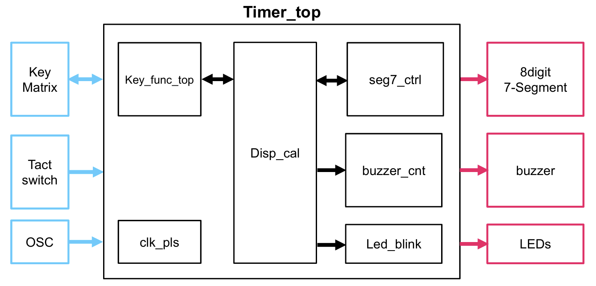
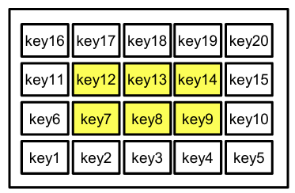
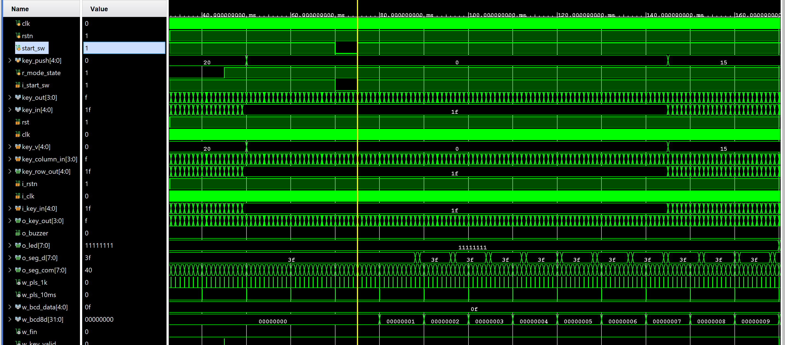
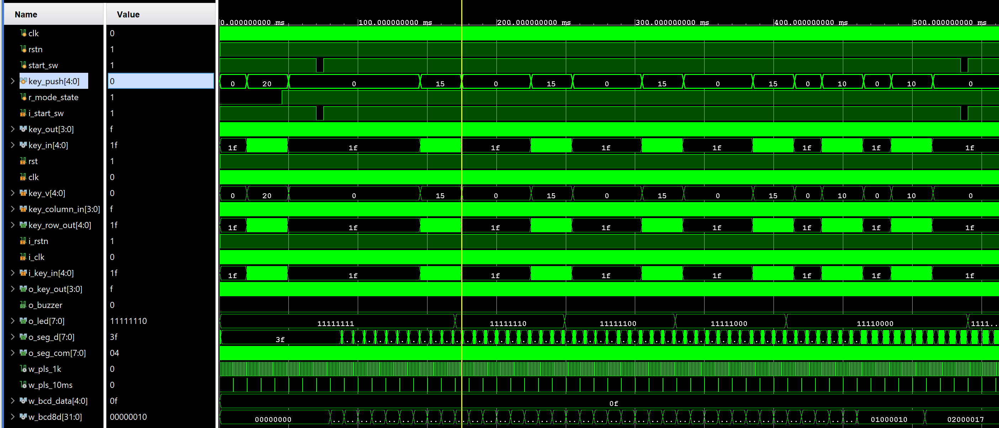
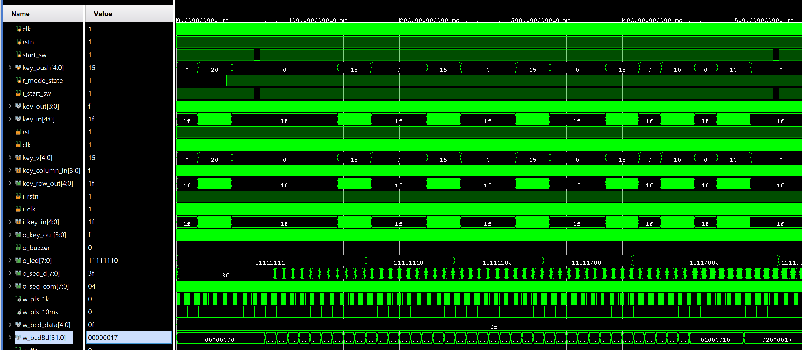
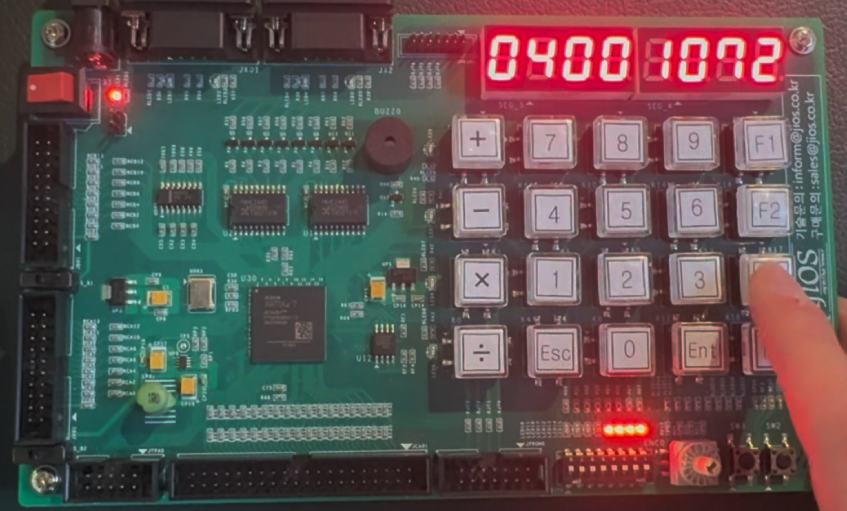

# FPGA_project

## Lap 기록 기능을 갖춘 Timer / Stopwatch 설계 (Verilog, Artix-7)

키패드로 시간을 설정하는 카운트다운 타이머 예제 코드를 확장해, 하나의 보드에서 **Timer 모드**와 **Stopwatch 모드**를 전환하며 쓸 수 있고 Stopwatch 모드에서는 **랩타임을 최대 8개 저장·조회**할 수 있도록 구현한 프로젝트입니다. 시뮬레이션으로 동작을 확인한 뒤 JFK-100A 보드(Xilinx Artix-7)에 올려 실제 동작을 검증했습니다.

---

## 프로젝트 목표

- 기존 Timer 설계의 모듈 구조(키 입력 → 표시값 계산 → 7세그먼트/LED/부저 출력)를 유지하면서 Stopwatch 기능을 추가
- 키패드에서 쓰이지 않던 기능 키(F1, F2, F3)에 모드 전환, 랩 저장, 랩 조회 기능을 할당
- 10ms 해상도로 동작하는 Stopwatch를 만들고, 랩타임 8개를 레지스터 배열에 저장해 순환 조회
- 저장된 랩 개수를 LED 8개로 표시해 현재 상태를 한눈에 확인

**개발 환경**

| 항목 | 값 |
|---|---|
| 보드 / FPGA | JFK-100A / Xilinx Artix-7 XC7A35T-FTG256 |
| 시스템 클럭 | 10 MHz |
| 언어 / 툴 | Verilog HDL / Vivado 2025.1 |
| 입력 | 5x4 키 매트릭스, Start 택트 스위치, 리셋 |
| 출력 | 8자리 7세그먼트, LED 8개, 부저 |

## 시스템 구조



| 모듈 | 역할 | 이번 프로젝트에서 변경한 내용 |
|---|---|---|
| `timer_top` | 최상위. 모듈 연결과 모드 상태 관리 | 모드 상태 레지스터 추가, 모드에 따라 LED 출력 선택 |
| `clk_pls` | 10 MHz 클럭에서 1ms 펄스 생성 | 1ms 펄스를 10번 세어 **10ms 펄스** 추가 |
| `key_scan` / `key_assign` | 키 매트릭스 스캔, 키 번호를 기능 신호로 변환 | key20/15/10을 **모드 전환 / 랩 저장 / 랩 조회** 펄스로 매핑 |
| `disp_cal` | 타이머 카운트다운과 표시값 계산 | **Stopwatch 카운트업, 랩 8개 저장, 조회 인덱스, 랩 LED** 로직 추가 |
| `seg8digit` | 8자리 7세그먼트 다이내믹 구동 | 변경 없음 |
| `buzzer_cnt` / `led_blink` | 타이머 종료 시 부저와 LED 점멸 | 변경 없음 |

## 과정

### 동작 시나리오



| 키 | 기능 | 동작 모드 |
|---|---|---|
| F1 (key20) | Timer ↔ Stopwatch 모드 전환 | 공통 |
| Start 스위치 | 카운트 시작 / 정지 토글 | 공통 |
| 4 / 5 / 6 (key12~14) | +10분 / +30분 / +60분 | Timer 시간 설정 |
| 1 / 2 / 3 (key7~9) | +10초 / +1분 / +5분 | Timer 시간 설정 |
| F2 (key15) | 현재 시간을 랩으로 저장 (최대 8개), 조회 중이면 실시간 표시로 복귀 | Stopwatch |
| F3 (key10) | 저장된 랩을 1번부터 순환 조회 | Stopwatch |

7세그먼트 표시 형식은 모드마다 다릅니다.

```
Timer      [0][0][시][시][분][분][초][초]   카운트다운, 00:00:00 도달 시 부저 + LED 점멸
Stopwatch  [0][0][분][분][초][초][cs][cs]   10ms 단위 카운트업, 최대 99:59.99
Lap 조회   [0][n][분][분][초][초][cs][cs]   n = 랩 번호(1~8), LED는 저장된 랩 개수만큼 점등
```

### 구현에서 신경 쓴 점

- **모드 전환 신호를 펄스가 아닌 상태로 관리**: 키 모듈이 내보내는 모드 신호는 키가 눌린 순간 한 클럭만 1이 되는 펄스라서, 그대로 `disp_cal`에 연결하면 모드가 곧바로 Timer로 돌아갔습니다. 최상위에 모드 상태 레지스터를 두고 펄스마다 토글하도록 바꿔 해결했습니다.
- **10ms 펄스 생성**: 기존 1ms 펄스를 4비트 카운터로 10번 세어 10ms 펄스를 만들고, Stopwatch 카운터는 이 펄스에만 증가하도록 해 시스템 클럭과 무관하게 해상도를 고정했습니다.
- **카운터 값의 시간 변환**: Stopwatch 카운터는 10ms 단위 정수라 그대로 출력하면 1초에 100이 표시됩니다. `% 100`, `/ 100 % 60`, `/ 6000`으로 분·초·1/100초를 분리하고 각 자리를 BCD로 나눠 7세그먼트 형식에 맞췄습니다.
- **랩 저장과 조회**: 랩 버튼의 상승 에지에서 현재 카운터 값을 `r_lap_time[0:7]`에 저장하고 개수를 증가시킵니다. 조회 버튼은 인덱스를 `0 → 1 → … → (개수-1) → 0`으로 순환시키고, 표시값 선택은 Timer / 조회 / 실시간 세 경로 중 하나를 고르는 mux 하나로 정리했습니다. Stopwatch를 정지하면 랩 기록이 초기화됩니다.
- **LED 출력 공유**: Timer 모드에서는 기존 종료 점멸 LED를, Stopwatch 모드에서는 랩 개수 LED를 내보내도록 최상위에서 모드에 따라 선택합니다. 보드 LED가 active-low라서 랩 LED는 반전해 출력합니다.

### 검증 1. 모드 전환과 Stopwatch 카운트업



key20 입력 후 `r_mode_state`가 0에서 1로 바뀌고, Start 스위치를 누르면 표시값 `w_bcd8d`가 10ms마다 1씩 증가하는 것을 확인했습니다.

### 검증 2. 랩 저장, LED 표시, 랩 조회



key15를 네 번 누를 때마다 `o_led`가 LSB부터 한 비트씩 켜지고(active-low), key10을 누르면 표시값이 `01_000010`, `02_000017`처럼 랩 번호와 저장된 시간(0.10초, 0.17초)으로 바뀌는 것을 확인했습니다.



### 검증 3. 보드 동작



보드에서 랩 4개를 저장한 뒤 조회한 화면입니다. 7세그먼트에 `04 00 10 72`(4번 랩, 00:10.72)가 표시되고 LED 4개가 켜져 있습니다. 전체 동작 영상은 [docs/디지털FPGA설계_시연영상.mp4](docs/디지털FPGA설계_시연영상.mp4)에 있습니다.

## 결과

| 항목 | 결과 |
|---|---|
| Stopwatch 해상도 / 최대 측정 | 10 ms / 99분 59.99초 |
| 랩 저장 개수 | 8개 (레지스터 배열) |
| 모드 전환, 랩 저장, 랩 조회 | 시뮬레이션과 보드에서 모두 정상 동작 확인 |
| 기존 Timer 기능 | 시간 설정, 카운트다운, 종료 부저·LED 점멸 유지 |

---

## 실행 방법

Vivado에서 새 프로젝트를 만들고(XC7A35T-FTG256) 아래 파일을 추가하면 됩니다.

```
Design Sources      src/*.v         (top: timer_top)
Constraints         src/timer.xdc
Simulation Sources  sim/*.v         (sim top: tb_stopwatch_lap in testbench.v)
```

- `sim/testbench.v`는 모드 전환 → Stopwatch 시작 → 랩 4개 저장 → 조회 순서로 자동 실행되며 콘솔에 단계별 값을 출력합니다.
- `sim/key_pad.v`는 키 매트릭스 하드웨어를 흉내 내는 시뮬레이션용 모델이라 합성 대상에서 제외합니다.
- `sim/tb_timer_top.v`는 원본 Timer 기능만 확인하는 기존 테스트벤치입니다.

### 프로젝트 구조

```
FPGA_project/
├── src/        # RTL(Verilog)과 핀 제약(xdc)
├── sim/        # 테스트벤치, 키패드 시뮬레이션 모델
├── figures/    # 블록도, 시뮬레이션 파형, 보드 사진
└── docs/       # 최종 보고서(PDF/PPTX), 시연 영상
```

## 참고

- 2인 팀 프로젝트입니다. 이 저장소의 작성자는 모드 전환 버그 수정, Stopwatch 표시 변환, 랩 8개 저장·조회, 랩 LED 표시를 담당했습니다.
- 키 스캔, 7세그먼트 구동, 부저, LED 점멸 모듈과 Timer 기본 로직은 수업에서 제공된 예제 코드를 기반으로 합니다.
- 라이선스: MIT

## 발표자료

- [최종 발표자료 (PDF)](docs/디지털FPGA설계_프로젝트보고서.pdf)
- [최종 발표자료 (PPTX)](docs/디지털FPGA설계_프로젝트보고서.pptx)
- [시연 영상 (MP4)](docs/디지털FPGA설계_시연영상.mp4)
